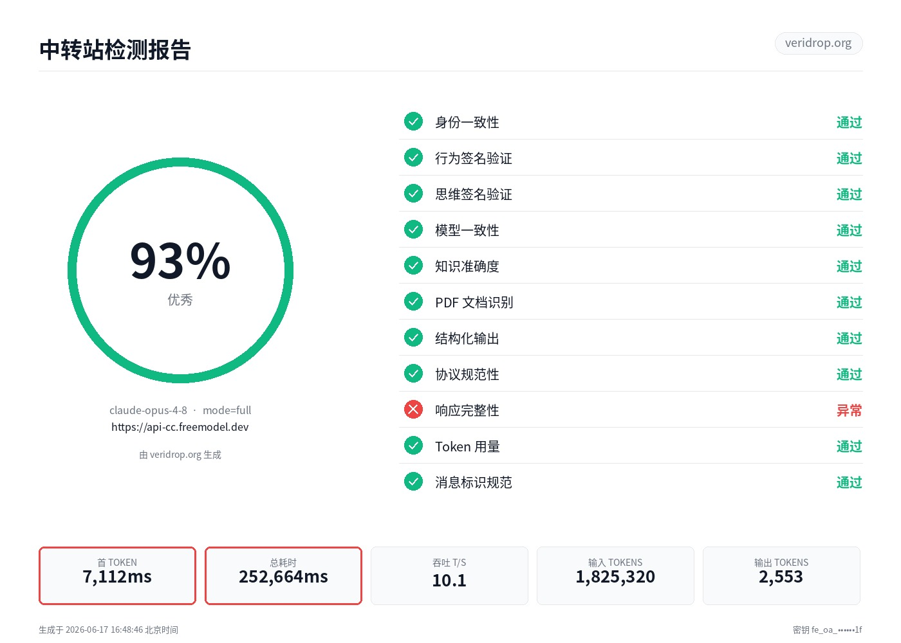

# FreeModel

[Try FreeModel 🡪](https://freemodel.dev/invite/FRE-0f2ca762)

Frontier AI, free for a month when you verify.

Sign up, verify your new account, and get one month of Pro free. Access the latest models through one simple, OpenAI-compatible API.

### One Month of Pro, Free

Verify your new account and get a full month of Pro at no cost — no payment information required. Start building right away.

### Frontier Models

Access the latest models such as Opus 4.8 and GPT 5.5 through one clean, simple API endpoint.

### OpenAI Compatible

A drop-in replacement for the OpenAI API that works with OpenAI-compatible SDKs and tools.

## How can I get more usage?

### Invite friends and earn $10 each

Share your referral link with friends. When someone signs up and verifies their account, you both receive $10 in API credits.

There is no referral cap, and the credits never expire. Signup and referral credits are applied automatically before your plan credits.

### Buy additional credits

You can also purchase extra API credits, which are applied automatically to every request.

The minimum top-up is **30 credits**, equivalent to **$1 USD**. You can purchase up to **$1,000 worth of credits**.

Supported payment methods:

* Alipay
* Apple Pay
* Cryptocurrency

## How is it so cheap?
It's an API proxy station. If you haven't heard yet, these posts explain it well:

[I vibe code with 100M+ GPT-5.4 tokens for ~$1/day - some stories from China](https://www.reddit.com/r/ChatGPT/comments/1tes18e/i_vibe_code_100m_tokens_with_codex_and_gpt54_for/)

[How to Buy Cheap Claude Tokens in China](https://www.chinatalk.media/p/how-to-buy-cheap-claude-tokens-in)

[Chinese students are buying GPT-5.4/5.5 and Claude API access from Xianyu/Taobao proxy sellers for almost 96-97% cheaper](https://www.reddit.com/r/tech_x/comments/1tfm69f/chinese_students_are_buying_gpt5455_and_claude/)

[China Is Scamming OpenAI?! (GPT-5 for $1)](https://www.youtube.com/watch?v=XoB4DXV7pUw)

## How do I know it won't secretly swap me to a cheaper model?

**Join the community**

**Test it yourself.** It's free. Benchmark the models. 

## Veridrop

[Veridrop](https://github.com/canarybyte/veridrop) is an open-source tool for benchmarking AI API relays and checking whether they actually provide the model and capabilities they advertise.

> [!WARNING]
> A complete Veridrop test can consume around **2 million input tokens**, particularly when long-context verification is enabled. Run it only when you have enough API credits available.

FreeModel's Claude relay received a score of **93/100 — Excellent**:

* **Model:** `claude-opus-4-8`
* **Test mode:** `full`
* **Relay:** `https://api-cc.freemodel.dev`
* **Brand:** `freemodel.dev`
* **Actual endpoint:** `api-cc.freemodel.dev`

[View the full Veridrop test report](https://veridrop.org/r/A7CcV2mb?from=share)

## What do each of the 12 tests check?

### Identity Consistency (Identity)

The model is asked to identify itself. The response must contain “Claude” and “Anthropic” and cannot identify itself as another brand, such as Kiro or AWS Q.

### Behavioral Signature Verification (Behavioral)

Three behavioral fingerprint questions covering Markdown style, list preferences, and refusal tone. The genuine Claude has a distinctive response pattern.

### Thinking Signature Verification (Thinking) ⭐

Core detection: the encrypted `signature` bytes returned by the Claude thinking block cannot be forged by any relay provider.

### Model Consistency (Consistency)

Verifies that `response.model` matches the requested model and that the output length remains stable across multiple calls using the coefficient of variation, or CV.

### Knowledge Accuracy (Knowledge)

Five general-knowledge questions about Anthropic, including its CEO, headquarters, Constitutional AI, and more. Many incorrect answers indicate that the backend is not the real Claude.

### PDF Document Recognition

Submits a base64 PDF containing a magic string and checks whether the model can extract it correctly. Relay providers that strip multimodal content will fail.

### Structured Output (Tool Use)

Performs a real `tool_use` call and verifies five sub-items, including the `toolu_` ID prefix, JSON schema matching, and `stop_reason`.

### Protocol Compliance (Protocol)

The SSE event sequence and content block types must comply with Anthropic’s official specifications. This is passive detection and does not send additional requests.

### Response Integrity (Integrity)

The same prompt must return identical text, `input_tokens`, and `stop_reason` in both streaming and non-streaming calls.

### Token Usage

Checks whether `usage.input_tokens/output_tokens` exists in Claude Messages, whether the increase between short and long prompts is reasonable, and whether short outputs are not overreported. It also performs cross-validation using streaming and `count_tokens`.

### Message ID Specification (Message ID)

Message IDs must begin with `msg_`, and tool blocks must begin with `toolu_`. UUIDs or hardcoded values such as `tool_1` are typical signs of forgery.

### Long-Context Authenticity (Long Context)

This must be enabled when submitting the test. It uses needle-in-a-haystack probes at three levels — 32k → 100k → 200k tokens — to verify whether the relay provider truly delivers the advertised context window and to detect truncation or routing to a smaller-context model.

The Anthropic path uses the official `count_tokens` endpoint for precise token budgeting. The extreme level can adaptively probe up to 950k+ tokens based on the model’s full limit. Fable 5, Opus 4.8, Sonnet 4.6, and Opus 4.6/4.7 all support 1M.

## Refer & Earn

Invite a friend and both of you get $10 in API credits once they verify their account. There is no referral cap, the credits never expire, and any email provider is supported.

## FAQ

**Is there a limit on how many friends I can invite?**

No. Invite as many as you like — every verified signup earns you $10 in API credits.

**When do credits arrive?**

Usually within about a minute of your friend completing Telegram verification. If they never verify, no credit is issued.

**Do credits expire?**

No. They remain in your balance until consumed through API usage.

**Can I refer myself using a different email address?**

No. Duplicate accounts are detected using signals such as IP address, device, and payment method. Self-referral credits are reversed automatically.

**Why didn't my referral earn credits?**

Credits are released only after your friend verifies their account. Until then, the referral appears as **Pending** in your referral dashboard. Any email domain is supported.

## Privacy Policy

FreeModel (“we”, “us”, or “our”) operates freemodel.dev and the FreeModel API. This policy explains what data we collect, how we use it, and your rights as a user.

### Contents

1. [Information we collect](https://freemodel.dev/privacy#info-we-collect)
2. [How we use your information](https://freemodel.dev/privacy#how-we-use-your-information)
3. [Data sharing](https://freemodel.dev/privacy#data-sharing)
4. [Data retention](https://freemodel.dev/privacy#data-retention)
5. [Security](https://freemodel.dev/privacy#security)
6. [Your rights](https://freemodel.dev/privacy#your-rights)
7. [Cookies](https://freemodel.dev/privacy#cookies)
8. [Children's privacy](https://freemodel.dev/privacy#childrens-privacy)
9. [Changes to this policy](https://freemodel.dev/privacy#changes-to-this-policy)
10. [Contact](https://freemodel.dev/privacy#contact)

## Terms of Service

These Terms of Service (“Terms”) govern your access to and use of freemodel.dev and the FreeModel API (collectively, the “Service”). By using the Service, you agree to these Terms. If you do not agree, do not use the Service.

### Contents

1. [Eligibility](https://freemodel.dev/terms#eligibility)
2. [Accounts](https://freemodel.dev/terms#accounts)
3. [Acceptable use](https://freemodel.dev/terms#acceptable-use)
4. [API access & rate limits](https://freemodel.dev/terms#api-access)
5. [Billing & payments](https://freemodel.dev/terms#billing)
6. [Intellectual property](https://freemodel.dev/terms#intellectual-property)
7. [Your content](https://freemodel.dev/terms#your-content)
8. [Disclaimers](https://freemodel.dev/terms#disclaimers)
9. [Limitation of liability](https://freemodel.dev/terms#liability)
10. [Termination](https://freemodel.dev/terms#termination)
11. [Governing law](https://freemodel.dev/terms#governing-law)
12. [Changes to these Terms](https://freemodel.dev/terms#changes)
13. [Contact](https://freemodel.dev/terms#contact)
